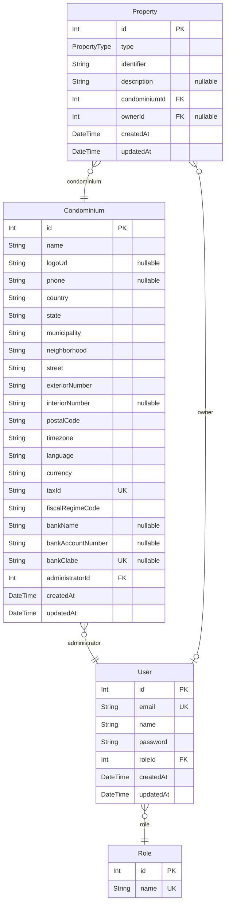

# Prisma Markdown

> Generated by [`prisma-markdown`](https://github.com/samchon/prisma-markdown)

- [default](#default)

## default

### `User`

Properties as follows:

- `id`:
- `email`:
- `name`:
- `password`:
- `roleId`:
- `createdAt`:
- `updatedAt`:

### `Role`

Properties as follows:

- `id`:
- `name`:

### `Condominium`

Properties as follows:

- `id`:
- `name`:
- `logoUrl`:
- `phone`:
- `country`:
- `state`:
- `municipality`:
- `neighborhood`:
- `street`:
- `exteriorNumber`:
- `interiorNumber`:
- `postalCode`:
- `timezone`:
- `language`:
- `currency`:
- `taxId`:
- `fiscalRegimeCode`:
- `bankName`:
- `bankAccountNumber`:
- `bankClabe`:
- `administratorId`:
- `createdAt`:
- `updatedAt`:

### `Property`

Properties as follows:

- `id`:
- `type`:
- `identifier`:
- `description`:
- `condominiumId`:
- `ownerId`:
- `createdAt`:
- `updatedAt`:
